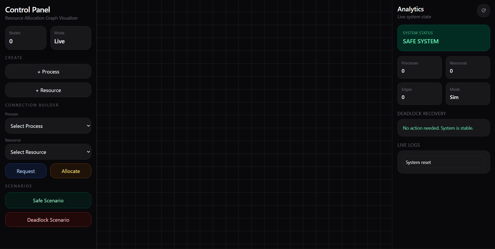
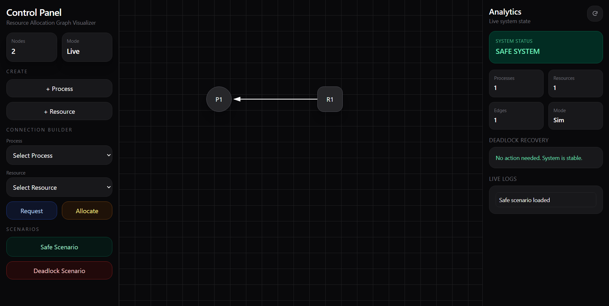
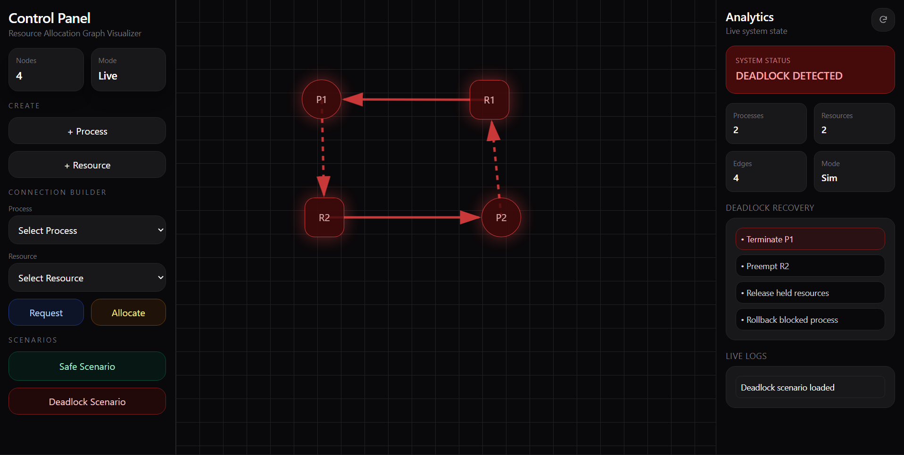

# 🚦 Resource Allocation Graph Visualizer

An interactive **Operating Systems project** that demonstrates how processes and resources interact using a **Resource Allocation Graph (RAG)**. The application visually simulates **resource requests, allocations, deadlock detection, circular wait conditions, and recovery strategies** in real time.

---

## 🌐 Live Demo

🔗 **Hosted Application:** https://os-rag.vercel.app/

---

## 📸 Screenshots

### Main Interface



### Safe Scenario



### Deadlock Scenario



---

## 📌 Project Overview

In modern operating systems, multiple processes compete for limited resources such as:

- Memory Blocks  
- Files  
- Printers  
- I/O Devices  
- Semaphores  
- CPU Resources  

Improper allocation of these resources can lead to **Deadlock**, where processes wait indefinitely and system progress stops.

This project was built to make these theoretical concepts easier to understand through an interactive visual simulator.

---

## 🎯 Objectives

- Visualize process-resource interaction using graphs  
- Simulate resource requests and allocations dynamically  
- Detect deadlocks automatically  
- Highlight circular wait conditions  
- Demonstrate deadlock handling strategies  
- Provide an educational learning tool for OS students  

---

## 🧠 Core Concepts Implemented

## Resource Allocation Graph (RAG)

The graph contains two types of nodes:

- 🔵 **Process Nodes** → Circular nodes  
- 🟦 **Resource Nodes** → Square nodes  

## Edge Types

- **Process → Resource** = Request Edge  
- **Resource → Process** = Allocation Edge  

## Deadlock Condition

If a circular dependency exists in the graph, the system automatically detects a **Deadlock State**.

---

## ✨ Features

## 🎮 Interactive Simulation

- Add Processes dynamically  
- Add Resources dynamically  
- Drag nodes freely across canvas  
- Real-time graph rendering  

## 🔗 Connection Builder

- Create Request Edges  
- Create Allocation Edges  
- Arrowhead directional flow  

## 🚨 Deadlock Detection

- Automatic cycle detection  
- Culprit edges highlighted in red  
- Involved nodes glow red  
- Status panel updates instantly  

## 🎭 Scenario Presets

- ✅ Safe Scenario  
- ❌ Deadlock Scenario  

## 📊 Analytics Dashboard

- Total Processes  
- Total Resources  
- Total Edges  
- Current System State  

## 🛠 Recovery Strategies

Displays theoretical deadlock recovery approaches:

- Process Termination  
- Resource Preemption  
- Rollback  
- Circular Wait Removal  

## 📝 Utility Features

- Live Logs  
- Reset Simulation  
- Responsive Premium UI  

---

## 🧰 Tech Stack

- **React.js**
- **Vite**
- **Tailwind CSS**
- **JavaScript**
- **Framer Motion**

---

## 📁 Project Structure

```text
src/
 ┣ components/
 ┃ ┣ LeftPanel.jsx
 ┃ ┣ RightPanel.jsx
 ┃ ┗ GraphCanvas.jsx
 ┣ utils/
 ┃ ┗ deadlock.js
 ┣ App.jsx
 ┗ main.jsx
 ```


 ## ⚙️ How Deadlock Detection Works

The application internally models all nodes and edges as a directed graph.

### Algorithm Flow

1. Build adjacency list  
2. Traverse graph using **DFS (Depth First Search)**  
3. If a back-edge / cycle is found → **Deadlock exists**  
4. Highlight involved nodes and edges  
5. Update system status panel  

---

## 🖥 Demo Workflow

### ✅ Safe Scenario

- No circular dependency exists  
- System remains safe  
- Resources can continue allocation  

### ❌ Deadlock Scenario

- Processes wait for each other's resources  
- Circular wait occurs  
- Deadlock detected instantly  

---

## 🚀 Run Locally

```bash
git clone https://github.com/CalmaCodes/Resource-Allocation-Graph-Visualizer.git
cd Resource-Allocation-Graph-Visualizer
npm install
npm run dev
```

## 🔮 Future Enhancements

- Banker’s Algorithm module  
- Resource instance counts  
- Export / Import scenarios for reproducibility
- Step-by-step simulation mode  
- Process scheduling integration  
- Multi-user collaboration mode  

---

## 📚 Educational Value

This project helps students understand:

- Mutual Exclusion  
- Hold and Wait  
- No Preemption  
- Circular Wait  
- Deadlock Prevention  
- Deadlock Avoidance  
- Deadlock Detection  
- Deadlock Recovery  

---

## 👥 Team Members

- Somtirtha Acharya — Project Development, Logic Integration, Deployment
- Kajal Dahiya — Testing, Documentation, Review
- M.Bhargav Naidu — Presentation, QA, Support

---

## 🔗 Repository

**GitHub Source Code:**  
https://github.com/CalmaCodes/Resource-Allocation-Graph-Visualizer.git

---

## 📜 License

Created for **academic and educational purposes**.

